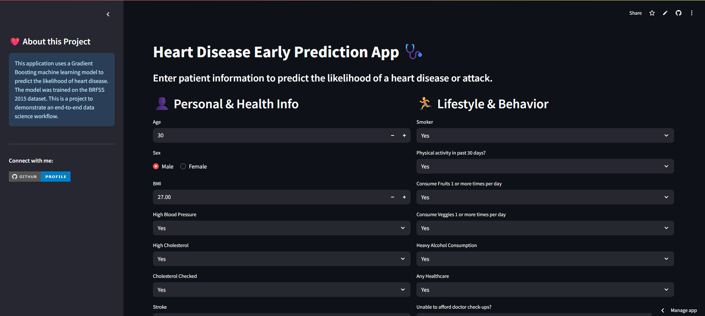

# Heart Disease Prediction Web Application




This project is an end-to-end data science application that predicts the likelihood of a person having heart disease based on various health indicators. The project includes a complete workflow from data exploration and model training in a Jupyter Notebook to a deployed interactive web application built with Streamlit.

**Live Demo →** [**https://heart-disease-prediction-app-e6pfbpgxakjux7asffax7w.streamlit.app/**](https://heart-disease-prediction-app-e6pfbpgxakjux7asffax7w.streamlit.app/)

---

## Features

- **Exploratory Data Analysis (EDA):** In-depth analysis of the BRFSS2015 dataset to understand feature distributions and correlations.
- **Data Preprocessing:** Handling of categorical and numerical features.
- **Handling Class Imbalance:** Explored techniques like SMOTE (Oversampling), RandomUnderSampler (Undersampling), and SMOTEENN to address the imbalanced dataset.
- **Model Training & Evaluation:** Trained and evaluated multiple classification models, selecting Gradient Boosting as the final model based on performance metrics like AUC score.
- **Interactive Web App:** A user-friendly interface built with Streamlit that allows users to input their health metrics and receive a real-time prediction.

---

## Tech Stack

- **Data Analysis & Modeling:** Python, Pandas, NumPy, Scikit-learn, XGBoost, Matplotlib, Seaborn
- **Web Application:** Streamlit
- **Model Persistence:** Joblib

---

## Project Structure

├── models/

│ └── gb_model_v1.0.pkl

├── notebooks/

│ └── Heart_Disease_Model_Development.ipynb

├── data/

│ └── heart_disease_health_indicators_BRFSS2015.csv

├── assets/

│ └── app_screenshot.png

├── .gitignore

├── app.py

├── LICENSE

├── README.md

└── requirements.txt

---

## Setup and Run

To run this project locally, please follow these steps:

1.  **Clone the repository:**
    ```sh
    git clone https://github.com/YourUsername/heart-disease-prediction-streamlit.git
    cd heart-disease-prediction-streamlit
    ```

2.  **Create a virtual environment (recommended):**
    ```sh
    python -m venv venv
    source venv/bin/activate  # On Windows, use `venv\Scripts\activate`
    ```

3.  **Install the required dependencies:**
    ```sh
    pip install -r requirements.txt
    ```

4.  **Run the Streamlit application:**
    ```sh
    streamlit run app.py
    ```

The application should now be running in your web browser!
